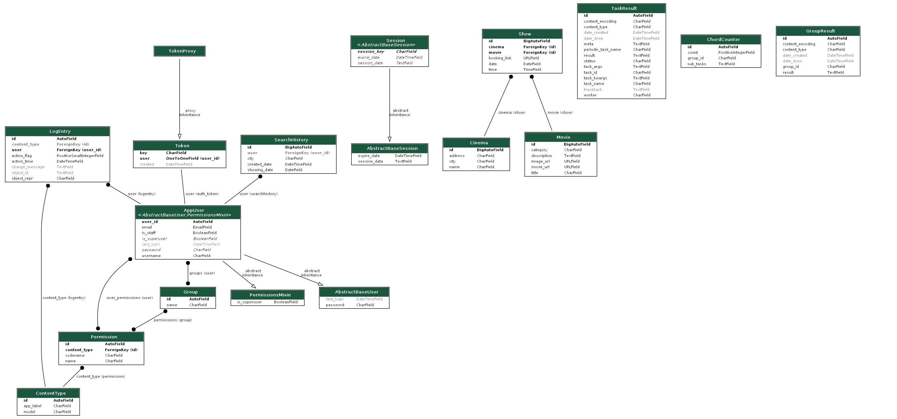

# MovieMade
Welcome to MovieMate, a one-stop solution for movie enthusiasts in Poland. MovieMate offers an interface where users can select their city and date to view all available movie showtimes, along with links for reservations. By scraping data daily from the websites of two of the largest cinemas in Poland, Multikino and Helios, we keep our information up-to-date and comprehensive. More cinemas will be added over time as we continue to expand the functionality of our site.

The backend of the application is hosted on an AWS EC2 instance and the domain moviemate.uk.to is secured with an SSL certificate obtained via certbot. Continuous integration and deployment is managed through GitHub Actions, which includes quality checks via unit tests and pylint before any pull request is merged into the main branch. Additionally, any push to the main branch triggers a deployment to the AWS EC2 instance.

The frontend of the application is deployed on AWS CloudFront and can be accessed via [this link](https://d3jxswvg482l9t.cloudfront.net/).


## Features

- **Movie Showtimes**: Users can enter their city and date to view all movie showtimes from all cinemas in that city. The application provides detailed information about each showtime and includes links for additional details.

- **Data Scraping**: The application utilizes Python scripts with BeautifulSoup (bs4) and Selenium to scrape data. Once a day, the scraper executes tasks using RabbitMQ and Celery, gathering showtime information for all cities, cinemas, and corresponding dates. The data is then saved into the application's models.

- **API Management**: The movie_api module manages the API views using Django Rest Framework (DRF) and the filter module to process requests from the frontend. It ensures the appropriate data is passed to the frontend queries and records information about the retrieved data for analysis and further application development.

- **User Management**: The user_api module handles user and superuser creation. It enables the addition of new features as the application evolves.

- **Continuous Integration and Deployment**: This project uses GitHub Actions to ensure the quality of the code by running unit tests and pylint on every pull request. Additionally, pushes to the main branch trigger a deployment to the AWS EC2 instance.

- **SSL Certification**: The backend domain, moviemate.uk.to, is secured using an SSL certificate obtained via certbot.

- **Cloud Hosting**: The backend is hosted on an AWS EC2 instance and the frontend is deployed on AWS CloudFront. 

## Running Custom Management Commands

MovieMate allows to load cinema data and run scraper tasks directly through Django's custom management commands. You can use the `load_cinemas` and `run_scraper` commands as follows:

1. To load cinema data from the `cinemas.json` file:

```bash
python manage.py load_cinemas
```

2. To delete past show records from database:

```bash
python manage.py clean_shows
```

3. To run the scraper tasks for all cinemas:

```bash
python manage.py run_scraper --all
python manage.py run_scraper -a
```

Or for a specific cinema:

```bash
python manage.py run_scraper --cinema cinema_name
python manage.py run_scraper -c cinema_name
```

Replace cinema_name with multikino or helios. This will initiate the scraping process for the specified cinema.

Please note that the run_scraper command requires either -a (--all) or -c (--cinema) options. -a or --all will run tasks for all cinemas while -c or --cinema allows to specify a particular cinema.

## Backend Repository
The backend repository contains the server-side code for the MovieMade application. It uses Python and Django to handle API requests and communicate with the PostgreSQL database.

## Prerequisites
Before running the backend, make sure you have the following installed:

- Docker
- Docker Compose

## Installation
MovieMate is designed to run on Docker and docker-compose, allowing for easy setup and deployment. Follow these steps to get it up and running:

1. Clone the repository:
```bash
git clone https://github.com/UserMarekDrag/MovieMate-backend.git
```
2. Navigate to the directory.
```bash
cd moviemate
```
3. Build and start the Docker services:
```bash
docker-compose build
docker-compose up
```
4. The backend API will now be running at http://localhost:8000/.

## Database Schema



To generate a new database schema visualization, you can use the `django-extensions`'s `graph_models` command:

```bash
python manage.py graph_models -a -o moviemate_visualized.png 
```

## Documentation

To generate the documentation for the project, navigate to the docs folder and run:

```bash
sphinx-build -b html ./source build/
```
The HTML files for the documentation will be in the build directory.

## Testing

We use coverage to run unit tests and check the code coverage of our tests. To run the tests, use:

```bash
coverage run --source='.' manage.py test
```
Current test coverage is as follows:
Total coverage: 91%.

## Code Quality

We use pylint to maintain the quality of our code. To check the code with pylint, use:

```bash
pylint module_name
```
Current Pylint ratings are:

- moviemate module: 10.00/10
- scraper module: 10.00/10
- movie_api module: 10.00/10
- user_api module: 10.00/10

## API Endpoints
Our API allows you to interact with MovieMate in a programmatic way. Please check [API.md](API.md) for more details about the available endpoints.

To generate a new openapi.json file, run:
```bash 
curl http://localhost:8000/swagger.json > docs/openapi.json
```

## Frontend Repository
The frontend repository contains the client-side code for the MovieMade application. It uses React to build the user interface.

For instructions on setting up and running the frontend, please refer to the [MovieMate-frontend repository](https://github.com/UserMarekDrag/MovieMate-frontend).

## License
The MovieMade project is open-source and released under the MIT License. Feel free to use, modify, and distribute the code as per the terms of the license.

## Contact
If you have any questions or issues with the MovieMade project, please contact the project maintainers or create an issue in the respective repositories.

Happy movie managing with MovieMade! 🎥🍿🎞️

## Author 
Marek Drąg